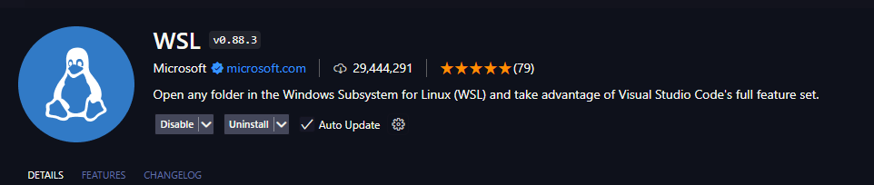
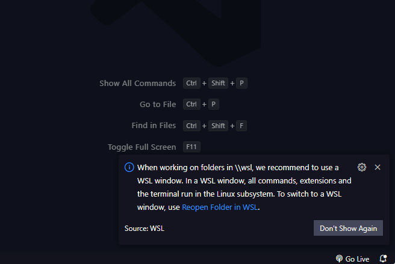
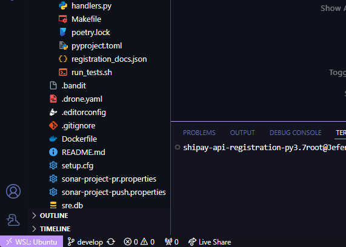

# WSL2

## Configurando VSCode para WSL2

É necessario instalar essa extensão no vscode para que ele reconheça o WSL2:

Proximo passo agora é abrir terminal no windows, efetuar a troca para Ubuntu.

Efetue a clonagem de um repositorio na pasta de preferencia e execute o comando:

``code nome_do_repostorio``

Caso seu VSCode apareça a mensagem no canto inferior direito igual imagem abaixo mostra, apenas clique em "Reopen Folder in WSL"

E note que na parte inferior esquerda indica que esta rodando sobre o WSL:

